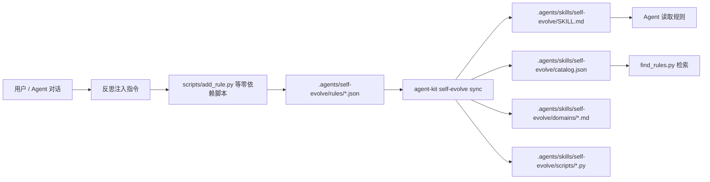

# self-evolve 技术架构

本文档面向维护者与二次开发者，目标是帮助读者快速理解 `self-evolve` 的技术架构、核心数据流、模块职责与运行方式。

## 1. 插件定位

`self-evolve` 是一个项目级知识规则管理插件。

它不负责记录 session、candidate 或其他中间实体，而是直接围绕正式 `Rule` 工作。整体设计追求两点：

- 数据结构尽量简单，降低 Agent 与用户的理解成本
- Skill 消费侧尽量自包含，生成后即使脱离插件源码也能被 Agent 使用

核心流程如下：

```text
Agent 反思 -> 脚本写入 Rule -> sync -> SKILL.md / catalog.json -> Agent 消费
```

也可以用流程图理解：



## 2. 设计原则

### 2.1 Rule-only

插件只维护一种正式知识实体：`KnowledgeRule`。

这样做的结果是：

- CLI 层非常薄，只保留基础设施命令
- Rule 的增删改查主要通过独立 Python 脚本完成
- Skill 模板可以直接指导 Agent 操作规则，无需理解额外状态机

### 2.2 项目本地优先

所有项目级数据都落在项目目录下，而不是用户全局目录：

- `.agents/self-evolve/` 保存配置与规则源数据
- `.agents/skills/self-evolve/` 保存生成后的 Skill 消费输出

这让规则能够跟随项目一起被审阅、提交和分享。

### 2.3 生成物自包含

`sync` 会把管理脚本、结构化索引和 Skill 模板一并复制到项目目录中，因此 Agent 只要读取项目内 `.agents/skills/self-evolve/`，就能完成检索和规则写入，不依赖安装态源码路径。

## 3. 目录与模块分层

当前源码主要分成 4 层。

### 3.1 CLI 层

- `src/self_evolve/plugin_cli.py`
- `src/self_evolve/messages.py`
- `src/self_evolve/locale.py`

职责：

- 暴露 `init`、`sync`、`status` 三个命令
- 处理 CLI 文案语言决议
- 协调配置加载、状态统计与同步动作

CLI 层不直接处理规则 CRUD。

### 3.2 配置与模型层

- `src/self_evolve/config.py`
- `src/self_evolve/models.py`
- `src/self_evolve/jsonc.py`

职责：

- 定义配置结构 `SelfEvolveConfig`
- 定义数据模型 `KnowledgeRule`
- 负责项目根目录探测、配置读取与模板语言决议
- 提供 JSONC 解析能力

### 3.3 存储与状态层

- `src/self_evolve/storage.py`
- `src/self_evolve/status_ops.py`

职责：

- 负责 `Rule` 的持久化读写
- 从规则目录聚合状态统计

这一层只关心本地文件系统，不关心模板渲染或 CLI 输出。

### 3.4 生成与脚本层

- `src/self_evolve/sync.py`
- `src/self_evolve/templates/*.tpl`
- `src/self_evolve/scripts/*.py`

职责：

- 把源规则渲染成 Agent 可消费的 Skill 输出
- 复制零依赖脚本到项目 Skill 目录
- 为 Agent 提供增删改查规则的实际执行入口

## 4. 数据模型

当前唯一正式模型是 `KnowledgeRule`：

```python
@dataclass(slots=True)
class KnowledgeRule:
    id: str
    created_at: str
    status: str
    title: str
    statement: str
    rationale: str
    domain: str
    tags: list[str]
    revision_of: str = ""
```

字段语义：

- `id`：规则 ID，格式约定为 `R-NNN`
- `created_at`：ISO 8601 时间戳
- `status`：当前主要使用 `active` 与 `retired`
- `title`：简短标题，用于列表和 Skill 展示
- `statement`：规则正文，强调可执行约束
- `rationale`：规则存在的原因
- `domain`：规则所属领域
- `tags`：辅助检索标签
- `revision_of`：预留修订链字段

模型支持 `to_dict()` / `from_dict()`，因此持久化格式与内存模型保持一一对应。

## 5. 配置与路径决议

配置文件固定在：

```text
<project-root>/.agents/self-evolve/config.jsonc
```

当前有效字段：

```jsonc
{
  "plugin_id": "self-evolve",
  "config_version": 5,
  "language": "zh-CN",
  "inline_threshold": 20
}
```

关键规则：

- `find_project_root()` 从当前目录向上查找，遇到 `.agents/self-evolve/` 或 `.git` 即认为到达项目根
- `language` 仅决定 Skill 模板语言
- CLI 文案语言仍由 `agent-kit` core 的语言链路决定
- 模板语言决议顺序为：项目配置 `language` -> `AGENT_KIT_LANG` -> `en`

这意味着 CLI 语言和生成出来的 `SKILL.md` 语言是解耦的。

## 6. 持久化布局

项目内会同时存在“源数据目录”和“生成输出目录”。

```text
<project-root>/
└── .agents/
    ├── self-evolve/
    │   ├── config.jsonc
    │   └── rules/
    │       ├── R-001.json
    │       ├── R-002.json
    │       └── ...
    └── skills/
        └── self-evolve/
            ├── SKILL.md
            ├── catalog.json
            ├── scripts/
            └── domains/
```

两类目录分工如下：

- `.agents/self-evolve/rules/` 是事实来源，保存正式规则源文件
- `.agents/skills/self-evolve/` 是消费输出，供 Agent 读取与调用

`storage.py` 负责前者，`sync.py` 负责后者。

## 7. 三个 CLI 命令如何工作

### 7.1 `init`

入口：`plugin_cli.py:init_command`

执行步骤：

1. 根据当前 `cwd` 寻找项目根
2. 如果已初始化，则直接提示并返回
3. 询问模板语言或读取 `AGENT_KIT_LANG`
4. 创建 `.agents/self-evolve/rules/`
5. 写入 `config.jsonc`
6. 立即调用 `sync_skill()` 生成首份 Skill 输出

因此 `init` 不只是写配置，还会生成一套可立即消费的初始 Skill 文件。

### 7.2 `sync`

入口：`plugin_cli.py:sync_command`

执行步骤：

1. 寻找项目根
2. 加载配置并读取 `inline_threshold`
3. 从 `rules/` 加载全部规则
4. 仅保留 `status == "active"` 的规则
5. 按规则数量决定 `inline` 或 `index` 策略
6. 生成 `SKILL.md`、`catalog.json`、可选的 `domains/*.md`
7. 复制零依赖脚本到 `.agents/skills/self-evolve/scripts/`

### 7.3 `status`

入口：`plugin_cli.py:status_command`

执行步骤：

1. 寻找项目根
2. 读取配置
3. 通过 `get_status()` 聚合规则状态与可观测信息
4. 输出以下内容：
   - 规则总数与各状态计数（active / retired 等）
   - active 规则的 domain 分布（按 domain 聚合计数）
   - 当前策略（inline 或 index）与 `inline_threshold` 阈值
   - 上次同步时间（读取 `catalog.json` 中的 `last_synced`）
   - 是否需要同步（比较 `rules/` 最新 mtime 与 `SKILL.md` mtime）

## 8. Rule CRUD 为什么放在脚本层

Rule CRUD 不走 CLI 子命令，而是放在生成后的脚本层，核心原因有三个：

- Agent 可以直接按 `SKILL.md` 中的命令模板执行
- 这些脚本只依赖 Python stdlib，移植成本低
- 生成后随项目分发，更符合“项目知识库”的定位

当前脚本分工：

- `add_rule.py`：新增规则、分配下一个 `R-NNN`、做重复检测
- `edit_rule.py`：更新既有规则字段
- `retire_rule.py`：将规则状态改为 `retired`
- `list_rules.py`：直接读取 `rules/` 目录做实时查询
- `find_rules.py`：读取 `catalog.json` 做消费侧检索

这里有一个很重要的架构区别：

- `list_rules.py` 面向源数据目录，结果更实时
- `find_rules.py` 面向同步后的 `catalog.json`，结果更贴近 Agent 消费视图

## 9. `sync` 引擎的职责拆分

`sync.py` 是整个插件最核心的模块，负责把“源规则”转换成“消费产物”。

### 9.1 策略选择

规则数 `<= inline_threshold` 时使用 `inline`：

- 所有规则直接内联进 `SKILL.md`
- 不生成 domain 详情页

规则数 `> inline_threshold` 时使用 `index`：

- `SKILL.md` 只保留 domain 索引表
- 每个 domain 的详情落到 `domains/*.md`

这样做是为了平衡两件事：

- 小规模规则集时，阅读路径最短
- 大规模规则集时，避免主 Skill 文件上下文膨胀

这里有一个额外约束：`domain` 是用户可写字符串，可能包含空格、斜杠或其他不适合作为路径片段的字符，也可能在归一化后产生同名冲突。因此 `sync.py` 在 `index` 策略下不会直接把原始 `domain` 落成文件名，而是先建立一层 `domain -> 安全文件名` 的映射。

当前策略为：

- 先把原始 `domain` 归一化为可读 slug
- 如果 slug 唯一，则直接使用 `<slug>.md`
- 如果多个 domain 命中同一个 slug，则该冲突桶中的所有 domain 都使用 `<slug>--<短哈希>.md`
- 如果 slug 命中 Windows 保留文件名（如 `con`、`prn`、`nul`、`aux`、`com1`、`lpt1` 等），也使用 `<slug>--<短哈希>.md`
- `SKILL.md` 的索引链接、domain 详情页输出和陈旧文件清理共用同一映射
- domain 详情页正文仍展示原始 `domain`，不改变规则语义或 `catalog.json` 内容

### 9.2 模板渲染

模板位于 `src/self_evolve/templates/`，使用 `string.Template` 渲染。

当前模板分为三类：

- `skill_main.*.md.tpl`：主 Skill 骨架，包含 frontmatter 和反思注入指令
- `skill_inline.*.md.tpl` / `skill_index.*.md.tpl`：规则主体内容
- `domain_detail.*.md.tpl`：index 策略下的详情页

### 9.3 结构化索引

`catalog.json` 是供脚本与 Agent 消费的结构化索引，基本结构如下：

```json
{
  "version": 1,
  "last_synced": "2026-04-01",
  "summary": {
    "total_rules": 3,
    "domains": {
      "debugging": 2,
      "testing": 1
    }
  },
  "rules": [
    {
      "id": "R-001",
      "title": "...",
      "statement": "...",
      "rationale": "...",
      "domain": "debugging",
      "tags": ["env"],
      "created_at": "...",
      "revision_of": ""
    }
  ]
}
```

### 9.4 脚本复制

`_sync_scripts()` 会把源码内 `scripts/*.py` 全部复制到项目 Skill 输出目录。

这意味着：

- 插件升级后，重新 `sync` 可以把最新脚本投放到项目中
- Agent 实际调用的是项目内脚本副本，而不是安装环境里的源码文件

## 10. Skill 模板如何驱动 Agent

`skill_main.*.md.tpl` 同时承担两类职责：

- 展示已批准规则
- 定义“反思注入”工作流

模板会要求 Agent：

1. 先查重
2. 从对话上下文提取 `domain/title/statement/rationale/tags`
3. 调用 `add_rule.py` 写入规则
4. 提醒用户审阅并执行 `sync`

因此从架构上看，`self-evolve` 并不是“自动学习系统”，而是“由 Skill 指令驱动的半自动规则沉淀系统”。

## 11. 与 `agent-kit` core 的边界

`self-evolve` 负责项目内规则知识库本身，`agent-kit` core 负责插件运行外壳。

边界大致如下：

- core 负责插件安装、命令分发、CLI 全局语言链路
- `self-evolve` 负责项目根探测、规则数据、Skill 生成与脚本分发

也就是说：

- core 决定“如何启动插件”
- `self-evolve` 决定“如何管理项目规则”

## 12. 测试结构

当前测试按模块职责拆分：

- `tests/test_config.py`：配置与路径
- `tests/test_models.py`：模型序列化
- `tests/test_storage.py`：规则读写
- `tests/test_scripts.py`：五个脚本的行为与异常路径
- `tests/test_sync.py`：同步策略、模板语言、产物结构
- `tests/test_cli.py`：CLI 在项目子目录中的行为

推荐验证命令：

```bash
uv run pytest packages/self-evolve/tests -q
```

## 13. 当前架构的取舍

### 优点

- 认知负担低，核心实体少
- 生成物自包含，适合 Agent 直接消费
- 项目级持久化清晰，便于用 Git 审核
- CLI 层很薄，维护成本低

### 代价

- `find_rules.py` 依赖 `catalog.json`，需要 `sync` 后才反映最新视图
- 脚本路径解析依赖固定目录结构
- 规则写入与同步分离，数据源与消费视图可能短暂不一致

这些取舍是当前架构有意保留的简化结果。

## 14. 维护者最需要记住的事

如果只记三件事，应该是这三条：

1. `rules/` 才是源数据，`skills/self-evolve/` 全部都是生成物
2. CLI 只负责基础设施命令，Rule CRUD 主要在脚本层
3. `sync.py` 是源数据到 Agent 消费面的转换边界

理解了这三点，就能快速定位大多数改动应该落在哪一层。
